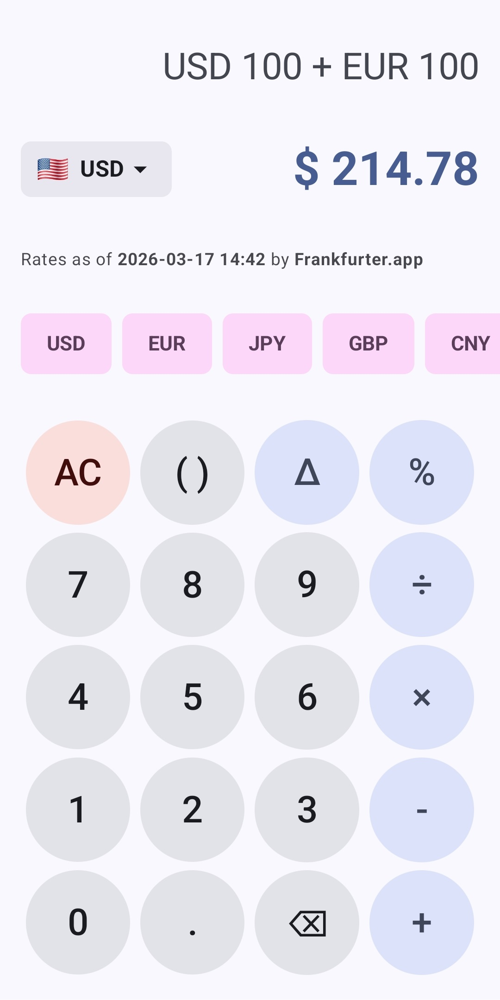
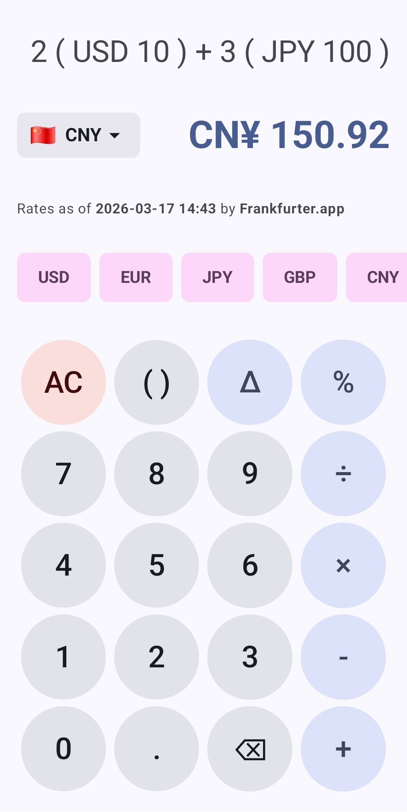
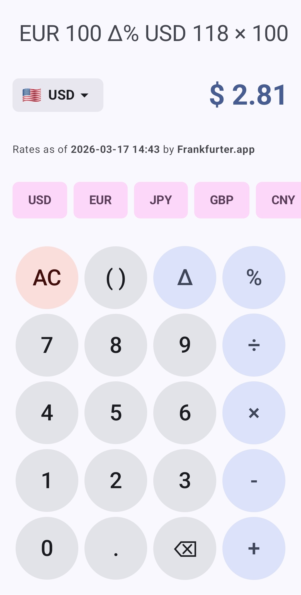
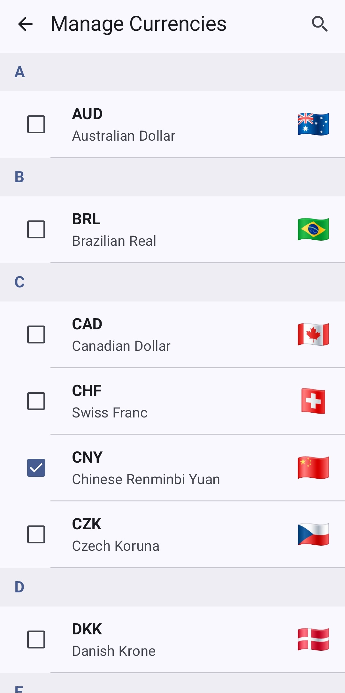

# PolyCurrency

A currency converter calculator designed to handle compound, multi-currency algebraic expressions in real-time. Works even when offline.

Unlike standard conversion apps that only convert single values, PolyCurrency features a custom-built mathematical engine that parses prefix-notation currencies (e.g., `USD 100 + EUR 100`), resolving them into pure scalar ratios to output a result in any supported target currency.

&nbsp;

&nbsp;

&nbsp;

## Key Features

* **Multi-Currency Algebra:** Add, subtract, multiply, and divide different currencies within the same expression.
* **Offline-Compatible:** Exchange rates are stored locally. If the device loses internet connection, the app falls back to the last known database values cached in Room.
* **Smart Parentheses & Implicit Multiplication:** Handles comound input strings like `2(USD 10) + 3(JPY 100)` without requiring explicit multiplication operators.
* **Custom Delta ($\Delta$) Operator:** Calculate exchange spreads, discounts, and markups (e.g., `EUR 100 Δ% USD 118 * 100`).

## The Mathematical Engine

This application features a custom mathematical parser designed to solve multi-currency arithmetic. The engine processes input in three distinct phases: **Tokenization**, **Normalization**, and **Evaluation**.

### Tokenization (Lexical Analysis)
When a user types an expression like `2(USD 10) + 2(JPY 100)`, the engine first breaks the raw string into a list of typed **Tokens**. This allows the app to handle "Implicit Multiplication" and custom mathematical logic.

| Input Segment | Token Type | Value |
| :--- | :--- | :--- |
| `2` | `Number` | `2.0` |
| `(` | `Parenthesis` | `(` |
| `USD` | `Currency` | `USD` |
| `10` | `Number` | `10.0` |
| `)` | `Parenthesis` | `)` |
| `+` | `Operator` | `+` |
...

### Normalization via Hub-and-Spoke

Before the math is performed, every `Currency` token must be transformed into a **Unitless Scalar Ratio**. 

Standard financial calculators convert inputs into a base currency before performing operations. This causes a cascading failure during scalar multiplication known as the **Dimensionality Problem**. For example, if the conversion ratio is $1.16$, evaluating $1 \times 1$ results in $(1 \times 1.16) \times (1 \times 1.16) = 1.3456$. The engine calculates "Square Dollars" ($Currency^2$).

To solve this, PolyCurrency separates the Data Layer from the Math Layer using a Hub-and-Spoke data model. Exchange rates are stored relative to a single Hub (Base Currency). When the engine encounters a currency token, it does not convert the value. Instead, it calculates a pure scalar ratio $S$ based on the user's current **Target Currency**:

$$S = \frac{\text{Target Rate}}{\text{Token Rate}} = \frac{\left(\frac{\text{Target Rate}}{\text{Base Rate}}\right)}{\left(\frac{\text{Token Rate}}{\text{Base Rate}}\right)}$$

Because the Base Currency cancels out, the mathematical sandbox operates on pure unitless scalars. By replacing currency tokens with these ratios, the engine turns a dimensional problem into a simple unitless expression. This ensures that a mathematical string like $1 \times 1$ evaluates to $1.0$, while a compound financial expression scales to the Target Currency.

### Evaluation (Shunting Yard)
Once the tokens are normalized, the engine uses the **Shunting Yard Algorithm** to convert the expression from Infix notation (human-readable) to **Reverse Polish Notation (RPN)**. This handles operator precedence (PEMDAS):

* **Infix:** `2 * (6.90 * 10.0) + 2 * (0.04 * 100.0)`
* **RPN:** `2 6.90 10.0 * * 2 0.04 100.0 * * +`

The final result is then pushed to the UI, providing a live, accurate calculation in the target currency as the user types.

### The Delta ($\Delta$) Operator

PolyCurrency includes a custom Delta operator designed to calculate the percentage change, exchange spread, or hidden bank fees between two values. 

The engine evaluates the $\Delta$ operator using the standard relative difference formula:

$$A \Delta B = \frac{B - A}{A}$$

**Real-World Example (Calculating Exchange Fees):**
Imagine your primary card is in **USD**, but you are purchasing an item priced at **EUR 100.00**. When your issuer sends a notification, you see you were actually charged **USD 118.00**. 

To calculate the exact markup (exchange spread + foreign transaction fee) your bank charged over the mid-market rate, you simply input:

`EUR 100 Δ% USD 118`

If the real-time exchange rate dictates that $1 \text{ EUR} = 1.15 \text{ USD}$ (meaning the true cost should be $114.78 \text{ USD}$), PolyCurrency's math engine automatically normalizes the baseline value ($A$) into your target currency before calculating the difference:

$$\frac{118.00 - 114.78}{114.78} = 0.0281 \text{ (or } 2.81 \text{ percent markup)}$$

This allows users to expose hidden financial fees instantly, without having to manually convert the foreign currency or construct the underlying algebraic brackets.

## Data Sourcing
PolyCurrency dynamically tracks and caches exchange rates for **30 major global currencies**, sourced directly from the [Frankfurter API](https://www.frankfurter.app/). Data is synced in the background and stored locally to ensure the calculator remains fully functional during travel or in areas with poor connectivity. Exchange rates are provided by the **European Central Bank**.

## Tech Stack & Architecture

* **UI:** Jetpack Compose (Edge-to-Edge, State Hoisting, dynamic WindowInsets).
* **Local Persistence:** Room Database (SQLite) for heavy exchange rate caching.
* **User Preferences:** DataStore (Preferences) for lightweight state management.
* **Concurrency:** Kotlin Coroutines & Flow.
* **Architecture:** MVVM (Model-View-ViewModel) with unidirectional data flow.

## Acknowledgments

**AI-Assisted Development:** The code for this project was written with the assistance of Google Gemini 3.1 Pro, operating under the architectural direction and QA of the repository owner.
